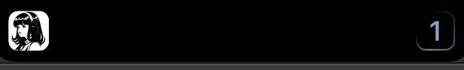
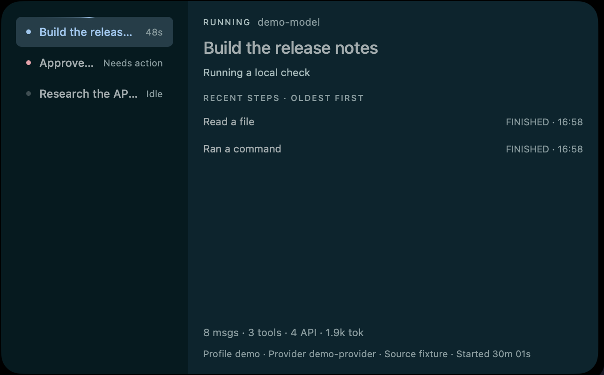

<div align="center">
  
  <h1>Hermes Notch Plugin</h1>
  <p>A native Hermes Agent plugin that brings session and turn status to Atoll on macOS.</p>
</div>

Hermes Notch Plugin reads Hermes' local state database in a read-only transaction and presents a compact monitor in Atoll's notch UI. It never writes `state.db` or sends state to a remote service. When a turn starts, the notch may show one bounded, sanitized display-side request preview: text parts only, with obvious secret patterns redacted. It never exposes transcript bodies, tool arguments, provider-only content, or credentials.

## What it does

- Shows active turns, sessions that need attention, and recent session details.
- Shows the actual session title with `Complete` in a brief sneak peek when a turn/session finishes. A confirmed lease release or durable `ended_at` boundary triggers it; a closed notch keeps rendering glyphs only.
- Floors dashboard rewrites at one every 5 s so the tab stays well inside Atoll's per-bundle extension rate limit, then delivers the final state on a deferred wake.
- Uses stable Atoll resource IDs and a single monitor process, so refreshes update the existing display instead of creating duplicates.
- Watches SQLite and WAL changes with `fswatch`, then falls back to periodic refreshes if `fswatch` is unavailable.

## Dummy-data media evidence

The media below was captured from the native Atoll surface with synthetic, display-only fixtures. It contains no real Hermes session titles, requests, transcripts, tool arguments, or desktop windows. The GIF is a timed native recording, not a slideshow; the PNGs are state captures.

<p></p>

<p></p>

| Capability | Evidence |
| --- | --- |
| Start request preview | [`notch-start.png`](assets/demo/notch-start.png) |
| One running turn and orbit | [`notch-running-1.png`](assets/demo/notch-running-1.png), timed [`hermes-notch-demo.gif`](assets/demo/hermes-notch-demo.gif) |
| Twelve running turns / two-digit count | [`notch-running-12.png`](assets/demo/notch-running-12.png) |
| Needs-action marker | [`notch-needs-action.png`](assets/demo/notch-needs-action.png) |
| Completion title, `Complete`, zero, and retraction | [`notch-complete.png`](assets/demo/notch-complete.png), [`notch-idle.png`](assets/demo/notch-idle.png), [`notch-hidden.png`](assets/demo/notch-hidden.png) |
| Expanded multi-session list, selection, details, recent steps, and stats | [`hermes-expanded-demo.png`](assets/demo/hermes-expanded-demo.png) |
| Watcher fallback, pacing, lifecycle, transition detection, and read-only data path | `npm test` and `python3 tools/test-plugin-entrypoint.py` (behavioral evidence; screenshots do not prove these nonvisual paths) |

The capture manifests are [`notch-phases.manifest.json`](assets/demo/notch-phases.manifest.json), [`hermes-notch-demo.manifest.json`](assets/demo/hermes-notch-demo.manifest.json), and [`hermes-expanded-demo.manifest.json`](assets/demo/hermes-expanded-demo.manifest.json). Re-run the native captures with the current, already-running CuaDriver socket (discover it from `ps`; never hardcode an old socket):

```sh
node tools/demo-effects.js all --seconds 6 \
  --capture-dir "$HOME/.hermes/cache/scratch/atoll-effect-demo" \
  --socket "$CUDRIVER_SOCKET"
node tools/record-demo-gif.js --socket "$CUDRIVER_SOCKET"

# Resolve the exact Atoll pid/window and inspect its live AX labels first.
# The expanded capture never accepts screen coordinates.
cua-driver call list_windows --socket "$CUDRIVER_SOCKET" --json '{}'
cua-driver call get_window_state --socket "$CUDRIVER_SOCKET" --json \
  '{"pid":'$ATOLL_PID',"window_id":'$ATOLL_WINDOW_ID',"include_screenshot":false}'
node tools/capture-expanded-demo.js \
  --socket "$CUDRIVER_SOCKET" \
  --pid "$ATOLL_PID" \
  --window-id "$ATOLL_WINDOW_ID" \
  --tab-label "$ATOLL_TAB_AX_LABEL"
```

`--tab-label` must be the exact actionable AX label from that fresh `get_window_state` response. Selection uses CuaDriver's background AX path, not the real pointer, focus, browser, hotkeys, or permissions. If the correct Hermes tab is already expanded, omit `--tab-label`; the script asserts the synthetic session labels in the background and captures only after that assertion. If the exact window or AX state cannot be verified, it fails closed without producing a screenshot; open the correct tab yourself and retry. The expanded manifest records the asserted pid/window, selection route, and labels.

## Requirements

- macOS 14 or newer on a MacBook with a notch. Setup uses the maintained [himanusia/Atoll fork](https://github.com/himanusia/Atoll), not the upstream repository.
- [Hermes Agent](https://github.com/NousResearch/hermes-agent) with its state database at `~/.hermes/state.db`. Set `HERMES_HOME` if your Hermes home is elsewhere.
- Node.js 22.5 or newer. The Hermes installer can install this plugin's pinned Node dependencies in its own plugin directory.
- Homebrew `fswatch` is recommended for faster updates; periodic refresh still works without it.
- Xcode 15 or newer is required only when Atoll is not already installed. There is currently no verified Atoll release asset for this fork, so setup builds the pinned fork source unsigned and does not claim notarization.

## Install

### With your AI agent (recommended)

Paste this single prompt into Claude Code, Codex, Cursor, Hermes, or another agent:

```
Install and set up https://github.com/himanusia/hermes-notch-plugin for me by following its README, then verify Hermes Notch Plugin status.
```

The README is written so an agent can install the Hermes plugin, ensure the maintained `himanusia/Atoll` fork is used, build it from the pinned source ref when no app is present, and verify the local monitor without replacing an existing Atoll installation.

### Manual

Install and enable the Hermes plugin:

```sh
hermes plugins install himanusia/hermes-notch-plugin --enable
```

Accept the installer's separate prompt to install the plugin's Node dependencies. Hermes keeps them in the plugin directory. Then let the integrated setup choose the safe path:

```sh
hermes notch setup
hermes notch status
```

`hermes notch setup` uses `https://github.com/himanusia/Atoll.git` at immutable commit `3ad728b8c318a51a6098949241d2ca4b6b99e637`. It builds `DynamicIsland.xcodeproj` / `DynamicIsland` with Xcode unsigned and installs only to a new `~/Applications/Atoll.app`. If an Atoll app already exists, setup detects it and never overwrites, signs, relaunches, clicks permissions, resets permissions, changes xattrs, or uses sudo. Preview the plan first with `hermes notch setup --dry-run`.

After starting/configuring Atoll yourself and enabling its local extension API, run `hermes notch status` again. The monitor starts on the next Hermes session; start it immediately with `hermes notch start`. When Atoll asks for authorization, allow the extension bundle `dev.hima.notch-plugins`.

## Manage the monitor

```sh
hermes notch status
hermes notch start
hermes notch stop
hermes notch restart
```

`stop` keeps the monitor off until the next Hermes session. Logs are written to `~/.hermes/logs/notch/hermes-atoll.log`. The existing `hermes atoll ...` command remains a compatibility alias; the stable Hermes plugin identity is still `hermes-atoll` so enabled users keep working.

To remove the plugin:

```sh
hermes notch stop
hermes plugins remove hermes-atoll
```

## Development

```sh
npm ci
npm test
python3 tools/test-plugin-entrypoint.py
python3 tools/test-notch-setup.py
hermes plugins doctor --ci .
```

The Node tests cover rendering, state transitions, host lifecycle, and SQLite/WAL watching. The Python smoke test checks Hermes hook and CLI registration without starting Atoll.

## Repository thumbnail

`assets/hermes-atoll-thumbnail.jpg` is a landscape 1733 × 908 monochrome illustration. It uses a subtle top-edge notch shape to suggest Atoll's Dynamic Island function. To set it as GitHub's social-preview image, upload the JPG from **Settings → General → Social preview**.

## License

ISC. See [LICENSE](LICENSE).
